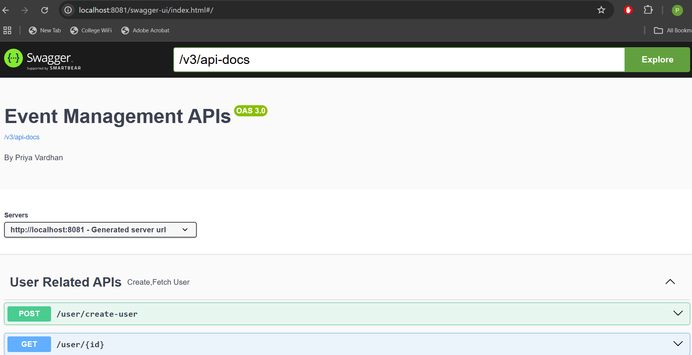
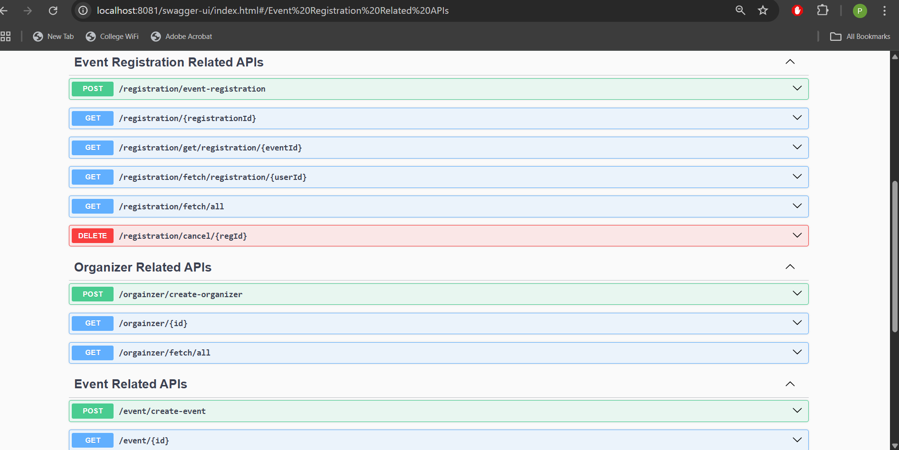
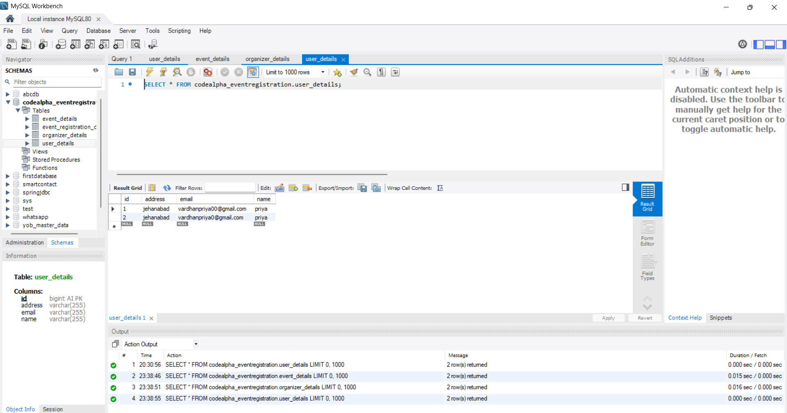

# Event Registration - User Service API

This is a Spring Boot-based RESTful API for managing user details in an event registration system. It currently supports creating new users and retrieving users by ID.

## 📌 Features

- ✅ Create a new user
- 🔍 Retrieve user details by ID
- Uses Spring Boot REST API architecture
- JSON-based request and response handling
-
- 🔹 Create a new event
- 🔹 Get event by ID
- 🔹 Fetch all events
- 🧑‍💼 Create new event organizers
- 🔍 Get an organizer by ID
- 📄 Fetch all registered organizers

- ✅ Register for an event
- 🔍 Get registration by ID
- 📄 Fetch all registrations
- 👤 Fetch registrations by user ID
- 🗓️ Fetch registrations by event ID
- ❌ Cancel a registration

## 🛠️ Tech Stack

- Java 17+
- Spring Boot
- Spring Web (REST)
- Spring data Jpa
- Mysql db
- Swagger 
- Jackson (for JSON handling)
- 

## 🚀 API Endpoints
👤 User API
POST /create-user — Create a new user

GET /{id} — Get user details by ID

📅 Event API
POST /create-event — Create a new event

GET /{id} — Get event by ID

GET /fetch/all — Fetch all events

🧑‍💼 Organizer API
POST /create-organizer — Create a new organizer

GET /{id} — Get organizer by ID

GET /fetch/all — Fetch all organizers

📝 Event Registration API
POST /event-registration — Register for an event

GET /{registrationId} — Get registration by ID

GET /fetch/all — Fetch all registrations

GET /fetch/registration/{userId} — Get registrations by user ID

GET /get/registration/{eventId} — Get registrations by event ID

DELETE /cancel/{regId} — Cancel registration by ID

### Screenshots
## 🖼️ Swagger UI Preview

